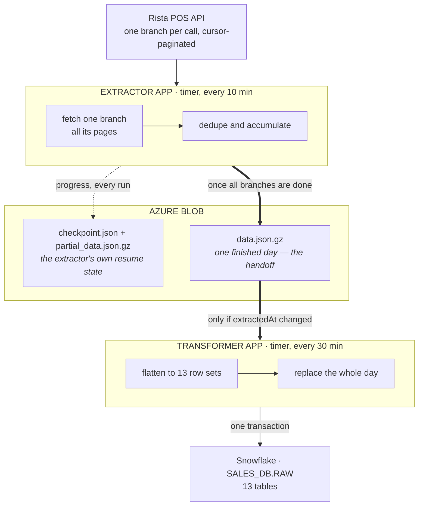
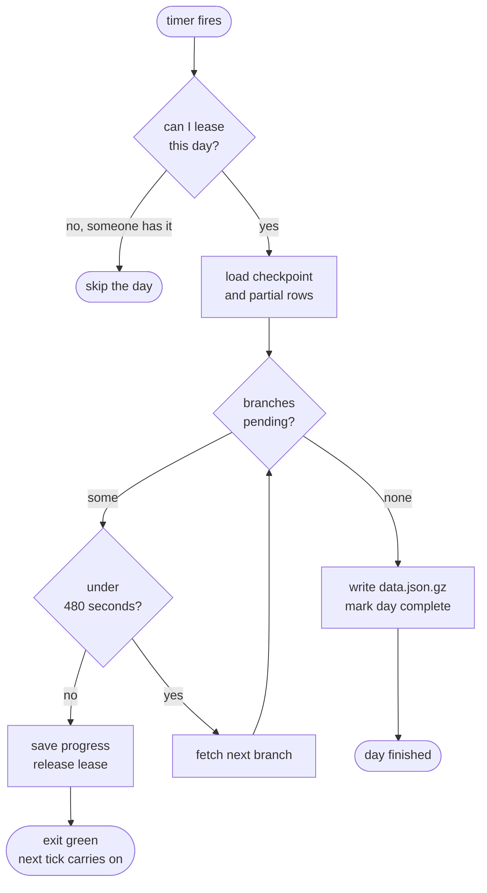

# Azure → Snowflake Sales Pipeline

A serverless ELT pipeline that pulls restaurant point-of-sale invoices from the Rista POS API into Snowflake. Two Azure Functions, decoupled through blob storage, with extraction that survives the 10-minute function timeout by checkpointing and resuming.

This is an anonymized copy of something I built and ran in production. Resource names, warehouse objects and business identifiers have been swapped for placeholders. No credentials are in this repo or its history. The code and the behaviour are untouched, including the parts that don't work — those are written up in [Data quality and known limitations](#data-quality-and-known-limitations).

## What it moves

Roughly 350 restaurant branches, one business day at a time. Every invoice, plus its line items, options, payments, charges, discounts, taxes, delivery details and event log, landing in 13 Snowflake tables.

| | |
|---|---|
| Source | Rista POS REST API, JWT-signed, cursor-paginated per branch per day |
| Staging | Azure Blob Storage, gzipped JSON, one snapshot per business day |
| Warehouse | Snowflake, `SALES_DB.RAW`, key-pair auth, `write_pandas` bulk load |
| Schedule | Extractor every 10 minutes, transformer every 30 |
| Runtime | Python 3.11 on Azure Functions, Linux Consumption plan |

## The problem

A day of sales sits behind an endpoint that answers one branch at a time and pages through a cursor. Pulling a full day means about 350 separate fetch loops, each running until its cursor runs out.

Azure Functions on the Consumption plan kills a run at 10 minutes.

That division is the whole story. 600 seconds across 350 branches leaves you about **1.7 seconds per branch**, and that has to cover the HTTP round trip, however many pages that branch has, and JSON parsing. The request timeout in this codebase is 120 seconds. A single slow branch can burn two minutes by itself. There is no arrangement of "fetch it all in one invocation" that survives a bad afternoon on the vendor's side.

Two obvious escapes, and why I passed on both:

**Get a bigger host.** A Premium plan or a container lifts the timeout. It also means paying for warm compute 24 hours a day to run a job that does real work for maybe twenty minutes, and it doesn't actually solve anything. It moves the wall. Add branches, hit it again.

**Fan out.** Split branches across parallel invocations. Now one polite API consumer becomes 350 impolite ones against a vendor endpoint with no documented rate limit, and partial failure gets much harder to reason about. When 40 of 350 workers fail, what state is the day in?

So I stopped treating "a day" as the unit of work.

The unit is **one branch**. Progress is a file in blob storage, not a variable in memory. A run claims a day, gets through as many branches as it can finish safely, writes down where it stopped, and exits green. Ten minutes later the timer fires and the next run reads the pending list and carries on. A day takes however many invocations it takes. Usually a handful. Nobody needs to care which.

Everything else in the extractor follows from that.

## How it fits together



The two function apps share no code and no dependencies. The extractor has never heard of Snowflake; the transformer has never heard of Rista. Their entire contract is a gzipped JSON file and a status field in a checkpoint. Either one can be redeployed, rolled back or triggered by hand without touching the other, which matters more than it sounds when you are debugging a bad day of data at 9am.

Here's what one extractor invocation actually does:



## The four things that make resuming work

### Progress lives in a file

Each business day owns a `checkpoint.json`: which branches are still pending, which are done, which have failed for good, how many attempts each has had, and a cached copy of the branch catalog. The rows collected so far sit next to it in `partial_data.json.gz`.

Resuming is therefore just reading the pending list. Branches already fetched are never fetched twice within a day. Caching the branch catalog matters too, since it means a resumed run spends zero API calls before it starts doing useful work.

When the pending list finally empties, the run builds the immutable `data.json.gz` snapshot and flips the checkpoint to `completed`. That status is what the transformer waits for.

### A blob lease stops two runs fighting

Timer triggers overlap more often than you'd like. A slow run, a host restart, someone hitting the manual trigger while the schedule is already going. Two runs mutating the same checkpoint would interleave their pending lists and quietly lose branches.

So a run takes an **Azure blob lease** on the day's checkpoint before touching it, and renews it as it works. A run that can't get the lease logs why and skips that day.

The interesting case is a worker that dies while holding one. Rather than wait for the lease to lapse, every run stamps a `lastHeartbeatAt` into the checkpoint body. A later run that gets a 409 reads that heartbeat, and if it's older than three lease periods it breaks the lease and takes over. A crashed worker costs one lease period instead of jamming the day until someone notices.

### Quit before you're killed

The host gives you 600 seconds. The extractor stops itself at 480 (`EXTRACTOR_RUN_BUDGET_SECONDS`). It checks the clock before each branch, and when the budget is gone it pushes the remaining branches back onto the pending list, saves, releases the lease and returns normally.

The difference between that and getting killed is not subtle. A killed invocation loses whatever was in memory, leaves a lease to expire, and shows up red in your monitoring for a reason that has nothing to do with your data. A budgeted exit leaves the day clean and resumable, and the run shows green because nothing went wrong. The 120-second gap absorbs a slow last branch plus the blob writes.

### One bad branch shouldn't cost you the day

Failure handling is layered, because "retry" means different things at different timescales.

At the HTTP level: 3 attempts, linear backoff, and only for timeouts, connection errors and 429/500/502/503/504. A 400 or a 404 fails immediately instead of spending the run's budget on a request that is never going to work.

At the branch level: a failed branch goes back on the pending list for a *later invocation*, not a tight retry loop. After `RISTA_BRANCH_ATTEMPTS` (default 2) it moves to `failedBranches` and the day carries on without it. Recovery time is measured in minutes, and a genuinely dead branch costs you that branch.

Then two guards that exist for specific bad outcomes:

If every branch failed, the run raises instead of publishing an empty snapshot. Publishing would mark the day `completed`, the transformer would pick it up, delete a day of Snowflake rows and insert nothing. This is the check that keeps a vendor outage from turning into data loss.

Pagination stops on an empty page, a missing cursor, a 500-page cap, or a page byte-for-byte identical to the one before it. That last condition is there because a cursor that stops advancing would otherwise spin happily until it hit the page cap.

## The transformer's version of the same problem

The transformer wakes up every 30 minutes. That's 48 runs a day, against days that have mostly not changed. Reloading unchanged data would burn Snowflake credits and churn the tables for nothing.

It uses the extraction timestamp as a fingerprint. Each successful load writes the snapshot's `extractedAt` into `transform_checkpoint.json`, and a day is only reloaded when the snapshot's timestamp differs from the recorded one. Re-extracting a day naturally produces a new timestamp, so refreshed days get picked up on their own and untouched days cost one blob read.

The load itself replaces a whole business day inside one transaction: delete every row for that `LAST_EXTRACTED_DAY` across all 13 tables, bulk insert the snapshot, convert the JSON string columns to native `VARIANT`, commit. Any failure rolls back the lot, so a day is either fully replaced or completely untouched. Never half-loaded, which is the state you really don't want to debug.

## Data model

One row per invoice in `SALES_HEADER`, keyed on `INVOICE_NUMBER`, with 12 child tables hanging off it keyed on the invoice plus a line number or a positional sequence. Every table carries `LAST_EXTRACTED_DAY` (the business day whose extract last wrote the row), `LOADED_AT` and `UPDATED_AT`.

Nested JSON gets one of three treatments, picked per field:

| Treatment | Used when | Example |
|---|---|---|
| Flatten into the parent | One level of scalars | `deliveryBy` becomes `DELIVERY_BY_NAME`, `DELIVERY_BY_PHONE` |
| Child table | An array you'll want to join and aggregate | `items[]`, `payments[]`, `charges[]` |
| `VARIANT` plus a summary column | Keep the array whole, but pre-compute the number everyone asks for | `taxes[]` becomes `TAXES_DETAIL` and `TAXES_TOTAL_AMOUNT` |

The third one does the most work. Analysts asking for tax totals or tag counts read a plain numeric column and never pay to traverse semi-structured data, and the full array is still sitting there when someone needs to audit a specific bill.

Full column catalog: [`docs/section-04-sales-schema.md`](docs/section-04-sales-schema.md).

## Repo layout

```
extractor_app/                  Azure Function: API to Blob
  function_app.py               Timer entry point, per-day loop, error capture
  shared/rista_client.py        HTTP client: JWT minting, retry policy, cursor pagination
  shared/blob_storage.py        Blob IO, checkpoint read/write, lease acquire/renew/break
  shared/extraction_runner.py   The resumable engine: budget loop, dedupe, snapshot assembly
  shared/work_plan.py           Which days to work on, 7-day sweep job manifest
  shared/pipeline_schedule.py   Cron constants, IST helpers, day-selection rules
  shared/api_call_logger.py     One CSV row per HTTP attempt, retries and failures included

transformer_app/                Azure Function: Blob to Snowflake
  function_app.py               Timer entry point, day selection, error capture
  shared/day_reload.py          One-day orchestration, shared by the timer and the CLI
  shared/blob_reader.py         Snapshot reads, completion and fingerprint gates, lease
  shared/snowflake_loader.py    Key-pair auth, transactional replace, VARIANT parsing
  shared/invoice_keys.py        The one invoice-key normalisation rule, imported by both sides
  transformers/sales_transformer.py   Pure function: nested JSON to 13 flat row sets
  scripts/historical_refresh.py Local CLI, reload a date range from blobs already on disk
  tests/                        Unit tests for the transform

sql/
  001_setup_env.sql             Warehouse, database, RAW schema, loader role, service user
  003_sales_tables.sql          14-table DDL with grants and clustering
  004_sales_variant_parse.sql   Standalone PARSE_JSON pass (the loader does this itself)
  005_sales_validation.sql      Post-load audit: PK duplicates, orphans, consistency, summary

docs/                           Schema mapping, load design, schedule design
```

Two files are smaller than they look. `invoice_keys.py` is five lines, and both the transform and the loader import it, because the invoice number is the join key for all 13 tables and two sides normalising it differently would produce orphan rows that nothing complains about. And `sales_transformer.py` does no IO at all, reads no environment, touches no database. That's deliberate, and it's why it's the one thing here with real test coverage.

## Running it

Full walkthrough including key generation and manual triggering: [`RUN_LOCAL.md`](RUN_LOCAL.md).

```powershell
# once: run sql/001_setup_env.sql then sql/003_sales_tables.sql

cd extractor_app                 # or transformer_app
python -m venv .venv
.venv\Scripts\Activate.ps1
pip install -r requirements.txt
copy local.settings.example.json local.settings.json    # then fill it in
func start --port 7071           # 7072 for the transformer
```

Timer functions have no HTTP route, so trigger them through the admin endpoint:

```powershell
Invoke-RestMethod -Method Post `
  -Uri "http://localhost:7071/admin/functions/rista_sales_extractor" `
  -ContentType "application/json" -Body '{"input":""}'
```

One invocation only *advances* a day, so keep triggering until you see `Extraction completed for <day>`.

### Configuration

Both apps read environment variables (App Settings on Azure, `local.settings.json` locally). The example files in each app folder contain placeholders only.

Extractor: `RISTA_API_KEY`, `RISTA_SECRET_KEY`, `RISTA_BASE_URL`, `AZURE_STORAGE_ACCOUNT`, `AZURE_STORAGE_KEY`, `AZURE_RAW_CONTAINER`, `AZURE_ERROR_CONTAINER`, and tuning knobs `EXTRACTOR_RUN_BUDGET_SECONDS`, `EXTRACTOR_LEASE_SECONDS`, `RISTA_MAX_PAGES`, `RISTA_REQUEST_TIMEOUT`, `RISTA_MAX_RETRIES`, `RISTA_RETRY_BACKOFF_SECONDS`, `RISTA_BRANCH_ATTEMPTS`, `API_CALL_LOG_DIR`, `EXTRACTOR_FORCE_REFRESH`.

Transformer: `AZURE_STORAGE_ACCOUNT`, `AZURE_STORAGE_KEY`, `SNOWFLAKE_ACCOUNT`, `SNOWFLAKE_USER`, `SNOWFLAKE_PRIVATE_KEY` (PEM body only, no BEGIN/END lines), `SNOWFLAKE_PRIVATE_KEY_PASSPHRASE`, `SNOWFLAKE_DATABASE`, `SNOWFLAKE_SCHEMA`, `SNOWFLAKE_WAREHOUSE`, `SNOWFLAKE_ROLE`, `TRANSFORM_LEASE_SECONDS`.

Both: `PIPELINE_TIMEZONE` (defaults to `Asia/Kolkata`), `TARGET_DAY` / `TARGET_DAYS`. On Azure also set `WEBSITE_TIME_ZONE=India Standard Time`, because the cron expressions are evaluated in the app's timezone and the 7-day sweep fires on a specific local hour.

Secrets belong in Key Vault, referenced from App Settings as `@Microsoft.KeyVault(VaultName=<vault>;SecretName=<name>)`, with the function app's managed identity granted **Key Vault Secrets User**.

> **Watch out for `TARGET_DAY`.** It overrides all day-selection logic on both apps, and on the extractor it also forces re-extraction of the days you name. Leave it set after a backfill and the pipeline stays pinned to a date in the past while current data silently stops arriving. There's no guard, no expiry, no warning in the logs. Clear it when you're done.

### Tests

```powershell
cd transformer_app
pip install -r requirements-dev.txt
python -m pytest tests -v
```

26 tests on the transform: invoice-key normalisation, child fan-out and sequence numbering, `VARIANT` serialisation, tax and refund summing, the vendor's misspelled field name, empty arrays becoming `NULL` rather than the string `"[]"`, and the invariant that every row produced by one call shares a load timestamp. No network, no storage, no database.

### Backfilling

```powershell
cd transformer_app
python scripts/historical_refresh.py --start 2026-05-01 --end 2026-05-28 --dry-run
```

Reloads Snowflake from snapshots already in blob storage, on one connection for the whole range, committing per day. Needs a completed snapshot for each day, so run the extractor first for anything missing.

## Data quality and known limitations

The parts worth knowing before you trust a number that came out of this. Items marked *(from code review)* were found by reading the code and haven't been reproduced in a controlled test.

### Designed, never built

`docs/section-05` describes a per-invoice merge: compare the incoming `NET_AMOUNT` against the stored row, skip invoices that haven't changed, and write paired `SUPERSEDED`/`INCOMING` audit rows into `SALES_INVOICE_HISTORY` when one has. **None of it was implemented.** The loader replaces the whole day. `SALES_INVOICE_HISTORY` gets created by the DDL and stays empty forever. The `skipped`, `replaced` and `history_rows` metrics are hardcoded zeros.

Two things follow for anyone querying this data:

There is **no change history**. If a bill is amended upstream and the day gets re-extracted, the old values are gone with no record that anything moved.

`SALES_INVOICE_HISTORY` always returns zero rows, and so do the audit checks in `sql/005` §8.

I annotated the docs and SQL in place rather than deleting them, so the design is still on record without misleading anyone about what runs today.

### Bugs

**The 7-day sweep can fail to drain, and blocks the normal schedule while it's stuck.** *(from code review)*

In `extractor_app/function_app.py`, a day whose checkpoint already says `completed` returns `skipped`, and the early `continue` for skipped days fires *before* the code that removes the day from the sweep's `pendingDays`. Since `should_force_refresh()` returns `False` for a completed day, a sweep across days that are already extracted removes nothing from its own queue. An in-progress sweep outranks the normal schedule and also stops a replacement sweep from starting, so there's no way out of the loop.

Setting `EXTRACTOR_FORCE_REFRESH=true` makes those days genuinely re-extract, which drains the queue, which is why the symptom may never appear in a deployment that has the flag on. To check: look at `rista/sales/jobs/timeline2.json` for a stale `startedOnDate` sitting next to a non-empty `pendingDays`.

**Type coercion is wired up but switched off.** `snowflake_loader.py` defines `_coerce_dataframe_date_columns` and `_coerce_dataframe_decimal_columns`, but the dictionaries that drive them (`DATE_COLUMNS_BY_TABLE`, `DECIMAL_COLUMNS_BY_TABLE`) are empty, so both functions do nothing. Date and numeric handling relies entirely on Snowflake's implicit casting during `write_pandas`. An out-of-range or oddly-typed value surfaces as a failed load rather than being coerced or rejected per column.

**The API-call CSV log writes into the deployment directory.** *(from code review)* `api_call_logger.py` defaults to `extractor_app/logs/api_calls/`, which on Azure lives under `/home/site/wwwroot` and is read-only when the app runs from package. The `mkdir()` happens inside the leased section and before the surrounding try block, so a failure there takes the whole extraction down with it. Point `API_CALL_LOG_DIR` somewhere writable or treat the CSV as a local debugging tool. Either way the files are ephemeral on Consumption; Application Insights is the real observability surface.

### Design limits

**The delete key isn't the primary key.** Deletes target `LAST_EXTRACTED_DAY`. The declared primary key is `INVOICE_NUMBER`, and Snowflake doesn't enforce primary keys. If the same invoice ever turns up under two different `target_day` values you get two header rows and nothing notices, because the duplicate check in `sql/005` groups *within* a single `LAST_EXTRACTED_DAY`. A cross-day check would need adding.

**The two stages dedupe on different keys.** The extractor dedupes on `(branchCode, invoiceNumber)`; the loader dedupes headers on `invoiceNumber` alone. If two branches ever shared an invoice number, one header would win while child rows from both survive, quietly attaching children to the wrong branch's header. The loader logs a warning when it drops a duplicate, which is the only signal you'd get.

**`pipeline_schedule.py` is duplicated across both apps and has already drifted.** The transformer's copy is missing the sweep logic the extractor's has. It should be a shared installable package. I left the duplication in place here because consolidating it across two independently deployed function apps is a packaging change, not a refactor, and doing it badly is worse than documenting it.

**Partial rows are saved once per run, not incrementally.** A hard crash mid-run throws away that run's collected branches. They stay pending so no data is lost, but up to a full budget window of API calls gets repeated.

**A whole day sits in memory.** The accumulated rows get deduped once per branch (`_dedupe_sales_records(rows + branch_rows)` rebuilds the dict every time, so O(n × branches)) and the full day is resident before it's gzipped. Fine at current volume. This is the first ceiling the design will hit.

**One failing day takes the rest of the tick with it.** Errors are written to blob and then re-raised so the invocation shows as failed, which means a persistently broken day blocks the days queued behind it until someone fixes or excludes it.

**Smaller things.** `UPDATED_AT` is always set to the same value as `LOADED_AT`, so it tells you nothing. `RISTA_BRANCH_RETRY_BACKOFF_SECONDS` is read into the client and never used, since branch retries wait for the next timer tick instead.

## License

[MIT](LICENSE)
