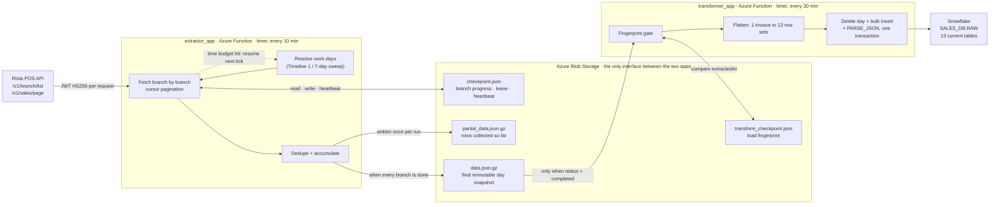

# Azure → Snowflake Sales Pipeline

Serverless ELT that replicates restaurant point-of-sale invoices from the Rista POS API into a Snowflake raw layer, built as two decoupled Azure Functions with resumable, checkpointed extraction.

---

## About this repository

This is an **anonymized version of real production work**. Infrastructure identifiers (resource
groups, storage accounts, key vaults, function app names), Snowflake object names, and business
identifiers have been replaced with generic placeholders. No credentials, keys, or connection
strings exist in this repository or its history.

The code, architecture, and runtime behaviour are otherwise unchanged — including the rough edges.
The [Data quality & known limitations](#data-quality--known-limitations) section documents what is
broken, what was designed and never built, and where the design will hit its ceiling. That section
is the most useful part of this README if you are evaluating the engineering rather than the
feature list.

---

## Architecture



The two function apps **share no code and no dependencies**. The extractor has no Snowflake or
pandas dependency; the transformer has no Rista or JWT dependency. Neither calls the other. Their
entire contract is a gzipped JSON snapshot in blob storage plus a status field in a checkpoint
file, which means either app can be redeployed, rolled back, or run manually without touching the
other.

---

## The engineering problem

**One business day of sales cannot be extracted in one function invocation.**

The source API is paginated per branch per day. With roughly 350 branches, a full day means ~350
independent cursor-paginated fetch loops. Azure Functions on a Consumption plan caps out at 10
minutes. A naive implementation gets killed mid-day, every day, and leaves partial state behind
with no way to tell how far it got.

The obvious fixes were both unattractive: moving to a Premium plan or a container to get a longer
timeout would raise cost and operational surface for a job that is idle 95% of the time, and
fanning branches out across parallel invocations would multiply API pressure against a vendor
endpoint with no published rate limit.

So the pipeline keeps the cheap serverless host and makes progress **resumable** instead. The unit
of work is one branch, not one day. State lives in blob storage, not in memory. A run does as much
as it safely can, writes down where it got to, and exits cleanly — and the next timer tick picks
up from there. A day takes as many invocations as it takes.

Four mechanisms follow directly from that decision.

### 1. Checkpointing

Each business day owns a `checkpoint.json` holding `pendingBranchCodes`, `completedBranchCodes`,
`failedBranches`, per-branch attempt counts, and a snapshot of the branch catalog. Rows collected
so far live beside it in `partial_data.json.gz`.

A run loads both, works through the pending list, and writes both back. Resume is therefore just
"read the pending list" — completed branches are never re-fetched within a day. Caching the branch
catalog in the checkpoint also means a resume costs zero extra API calls before it starts doing
useful work.

When the pending list finally empties, the run assembles the immutable `data.json.gz` snapshot and
flips the checkpoint to `completed`. That status field is the signal the transformer waits for.

### 2. Blob lease as a distributed mutex

Timer triggers can overlap — a slow run, a host restart, or a manual trigger during a scheduled
one. Two workers mutating the same checkpoint would interleave their pending lists and lose
branches.

Each run therefore acquires an **Azure blob lease** on the day's checkpoint before touching it, and
renews it mid-loop. A run that cannot get the lease logs and skips that day rather than competing
for it.

The failure mode that matters here is a worker dying while holding a lease. Rather than wait for
the lease to expire on its own, each run writes a `lastHeartbeatAt` into the checkpoint body. A
would-be successor that hits a 409 reads the heartbeat, and if it is older than three lease
periods it **breaks** the lease and takes over. A crashed worker costs one lease period, not a
stuck day.

### 3. Self-imposed time budget

The host timeout is 10 minutes; the extractor stops itself at 480 seconds by default
(`EXTRACTOR_RUN_BUDGET_SECONDS`). Before each branch it checks elapsed time, and if the budget is
spent it pushes the remaining branches back onto the pending list, persists, releases the lease,
and returns normally.

This is the difference between a graceful handoff and a kill. A killed invocation loses whatever
was in memory and leaves a lease to expire; a budgeted exit leaves the day in a clean, resumable
state and a green invocation in the logs. The ~2 minute margin absorbs a slow final branch and the
blob writes.

### 4. Failure isolation and attempt limiting

One unreachable branch must not block a day, and must not retry forever. Failure handling is
layered:

- **Transport retries** — up to 3 attempts with linear backoff, and only for timeouts, connection
  errors, and HTTP 429/500/502/503/504. A 400 or 404 fails immediately instead of burning the
  budget on a request that will never succeed.
- **Per-branch attempt cap** — a branch that fails is re-queued for a *later invocation*, not
  retried in a tight loop. After `RISTA_BRANCH_ATTEMPTS` (default 2) it is moved to
  `failedBranches` and the day proceeds without it. Recovery time is measured in minutes, and one
  bad branch costs one branch.
- **Empty-snapshot guard** — if every branch failed, the run raises instead of publishing an empty
  snapshot. Publishing would flip the day to `completed` and trigger the transformer to delete a
  day of Snowflake rows and replace them with nothing. This guard is the one that prevents a
  source outage from becoming data loss.
- **Pagination loop guard** — paging stops on an empty page, a missing cursor, a hard 500-page cap,
  **or** a page byte-identical to the previous one. The last condition exists because a cursor that
  stops advancing would otherwise spin until the page cap.

### The transformer's own idempotency problem

The transformer polls every 30 minutes, which is 48 runs a day against days that mostly have not
changed. Reloading unchanged data would burn Snowflake credits and churn the tables for nothing.

It uses the extraction timestamp as a **content fingerprint**. Each successful load records the
snapshot's `extractedAt` into `transform_checkpoint.json`; a day is reloaded only when the current
snapshot's `extractedAt` differs from the recorded one. Re-extraction naturally produces a new
timestamp, so genuinely refreshed days are picked up automatically and untouched days cost one blob
read.

Loading itself is a **day-level delete-then-insert inside a single transaction**: delete every row
for that `LAST_EXTRACTED_DAY` across all 13 tables, bulk insert the snapshot, convert the JSON
string columns to native `VARIANT`, commit. Any failure rolls the whole day back, so a day is
either fully replaced or untouched — never half-loaded.

---

## Tech stack

| Layer | Choice |
|---|---|
| Runtime | Python 3.11, Azure Functions v2 programming model (decorator-based, no `function.json`) |
| Hosting | Linux Consumption plan, timer triggers, 10-minute timeout |
| Source | Rista POS REST API — HMAC-signed JWT (HS256), cursor pagination |
| Staging + state | Azure Blob Storage — gzipped JSON, blob leases for mutual exclusion |
| Warehouse | Snowflake — RSA key-pair auth, `write_pandas` bulk load, `VARIANT` for nested JSON |
| Secrets | Azure Key Vault referenced from App Settings |
| Observability | Application Insights, plus per-HTTP-attempt CSV telemetry |
| Tests | pytest against the pure transform |

Dependencies are deliberately disjoint per app:

```
extractor_app     azure-functions, azure-storage-blob, PyJWT, requests, tzdata
transformer_app   azure-functions, azure-storage-blob, cryptography, pandas,
                  snowflake-connector-python[pandas], tzdata
```

---

## Data flow

1. **Day selection.** The extractor decides which business days to advance: an explicit
   `TARGET_DAYS` override, else a 7-day sweep started at 10:00 IST, else the standard schedule
   (yesterday and today before 09:00 IST; today after).
2. **Lock.** Acquire the blob lease on that day's checkpoint, or skip the day.
3. **Branch catalog.** On first run for a day, fetch `/v1/branch/list` and seed the pending list
   with every branch — active *and* inactive, since a closed branch can still have historical
   invoices.
4. **Fetch.** For each pending branch, page `/v1/sales/page?branch=&day=&lastKey=` to exhaustion.
   Every record is stamped with `requestedDay` and `requestedStatus` — the day that was queried and
   the invoice status *at extract time*, which is provenance the source does not provide.
5. **Accumulate.** Dedupe on `(branchCode, invoiceNumber)` and append to the in-progress row set.
6. **Persist or hand off.** Write partial data and checkpoint. If the budget is spent, exit for the
   next tick; if the pending list is empty, publish `data.json.gz` and mark the day `completed`.
7. **Fingerprint gate.** The transformer scans the last 8 calendar days and picks up any whose
   snapshot `extractedAt` differs from what it last loaded.
8. **Flatten.** One invoice becomes up to 13 rows: a header plus twelve child collections
   (items, item options, item event log, item discounts, charges, discounts, payments, event log,
   delivery, customer, source info, source customer). Nested arrays kept whole are serialized for
   `VARIANT`; tax arrays additionally get summed into scalar companion columns.
9. **Load.** Delete the day, bulk insert, `PARSE_JSON` the `VARIANT` columns, commit.
10. **Record.** Write the transform checkpoint with the fingerprint, row count, and metrics.

Failures at any step write a JSON dump — component, target day, error, traceback — to an `errors`
container, then re-raise so the invocation is marked failed and surfaces in monitoring.

---

## Repository layout

```
extractor_app/                    Azure Function: API → Blob
  function_app.py                 Timer entry point; per-day loop and error capture
  shared/rista_client.py          HTTP client: JWT minting, retry policy, cursor pagination
  shared/blob_storage.py          Blob I/O, checkpoint read/write, lease acquire/renew/break
  shared/extraction_runner.py     The resumable engine: budget loop, dedupe, snapshot assembly
  shared/work_plan.py             Which days to work; 7-day sweep job manifest lifecycle
  shared/pipeline_schedule.py     Cron constants, IST helpers, day-list rules, refresh policy
  shared/api_call_logger.py       One CSV row per HTTP attempt, including retries and failures

transformer_app/                  Azure Function: Blob → Snowflake
  function_app.py                 Timer entry point; day selection and error capture
  shared/day_reload.py            One-day orchestration, shared by the timer and the CLI
  shared/blob_reader.py           Snapshot reads, completion/fingerprint gates, transform lease
  shared/snowflake_loader.py      Key-pair auth, transactional delete+insert, VARIANT parsing
  shared/invoice_keys.py          The single invoice-key normalization rule, imported by both
  transformers/sales_transformer.py   Pure function: nested JSON → 13 flat row sets
  scripts/historical_refresh.py   Local CLI to reload a date range from existing blobs
  tests/                          Unit tests for the transform

sql/
  001_setup_env.sql               Warehouse, database, RAW schema, loader role and service user
  003_sales_tables.sql            14 table DDL with grants and clustering
  004_sales_variant_parse.sql     Standalone PARSE_JSON pass (the loader does this itself)
  005_sales_validation.sql        Post-load audit: PK duplicates, orphans, consistency, summary

docs/
  section-04-sales-schema.md      Nested-JSON→table mapping and column catalog
  section-05-sales-load-merge.md  Merge design — NOT IMPLEMENTED; see §0 in that file
  section-06-sales-extract-schedule.md   Schedules, day selection, checkpoint resume
```

Two details worth calling out. `invoice_keys.py` is five lines and is imported by both the
transform and the loader, because the invoice key is the join key for all 13 tables and the two
sides normalizing it differently would produce silent orphans. And `sales_transformer.py` is a
pure function by design — no I/O, no database, no environment reads — which is what makes it
directly testable.

---

## Data model

One row per invoice in `SALES_HEADER`, keyed on `INVOICE_NUMBER`, with twelve child tables keyed
on the invoice plus a positional sequence or line number. Every table also carries
`LAST_EXTRACTED_DAY` (the business day whose extract last wrote the row), `LOADED_AT`, and
`UPDATED_AT`.

Nested JSON is handled three ways, chosen per field:

| Strategy | When | Example |
|---|---|---|
| Flatten to parent columns | Single-level object of scalars | `deliveryBy` → `DELIVERY_BY_NAME`, `DELIVERY_BY_PHONE` |
| Child table | Array of records worth querying relationally | `items[]`, `payments[]`, `charges[]` |
| `VARIANT` + summary column | Array kept whole, but with a common aggregate | `taxes[]` → `TAXES_DETAIL` plus `TAXES_TOTAL_AMOUNT` |

The third pattern is the one that earns its keep: routine reporting reads a pre-computed scalar and
never pays to traverse semi-structured data, while the full array stays available for audit.

Full column catalog and mapping table: [`docs/section-04-sales-schema.md`](docs/section-04-sales-schema.md).

---

## Configuration

Both apps read configuration from environment variables (App Settings on Azure,
`local.settings.json` locally). Copy `local.settings.example.json` in each app folder and fill it
in; both example files contain placeholders only.

**Extractor** — `RISTA_API_KEY`, `RISTA_SECRET_KEY`, `RISTA_BASE_URL`, `AZURE_STORAGE_ACCOUNT`,
`AZURE_STORAGE_KEY`, `AZURE_RAW_CONTAINER`, `AZURE_ERROR_CONTAINER`, plus tuning:
`EXTRACTOR_RUN_BUDGET_SECONDS`, `EXTRACTOR_LEASE_SECONDS`, `RISTA_MAX_PAGES`,
`RISTA_REQUEST_TIMEOUT`, `RISTA_MAX_RETRIES`, `RISTA_RETRY_BACKOFF_SECONDS`,
`RISTA_BRANCH_ATTEMPTS`, `API_CALL_LOG_DIR`, `EXTRACTOR_FORCE_REFRESH`.

**Transformer** — `AZURE_STORAGE_ACCOUNT`, `AZURE_STORAGE_KEY`, `SNOWFLAKE_ACCOUNT`,
`SNOWFLAKE_USER`, `SNOWFLAKE_PRIVATE_KEY` (PEM body only, no BEGIN/END lines),
`SNOWFLAKE_PRIVATE_KEY_PASSPHRASE`, `SNOWFLAKE_DATABASE`, `SNOWFLAKE_SCHEMA`,
`SNOWFLAKE_WAREHOUSE`, `SNOWFLAKE_ROLE`, `TRANSFORM_LEASE_SECONDS`.

**Both** — `PIPELINE_TIMEZONE` (default `Asia/Kolkata`), `TARGET_DAY` / `TARGET_DAYS`.
On Azure also set `WEBSITE_TIME_ZONE=India Standard Time`, since the cron expressions are
evaluated in the app's timezone and the 7-day sweep triggers on a specific local hour.

> **Operational hazard.** `TARGET_DAY` / `TARGET_DAYS` override *all* day-selection logic on both
> apps, and on the extractor they also force re-extraction of the named days. Left set after a
> backfill, they silently pin the pipeline to a past date and current data stops flowing. There is
> no guard, no expiry, and no warning log — clear them when a backfill finishes.

Secrets belong in Key Vault, referenced from App Settings as
`@Microsoft.KeyVault(VaultName=<vault>;SecretName=<name>)`, with the function app's managed
identity granted **Key Vault Secrets User**.

---

## Running it

Full walkthrough, including key-pair generation and manual triggering:
[`RUN_LOCAL.md`](RUN_LOCAL.md).

```powershell
# Snowflake objects, once
#   run sql/001_setup_env.sql, then sql/003_sales_tables.sql

# Either app
cd extractor_app                 # or transformer_app
python -m venv .venv
.venv\Scripts\Activate.ps1
pip install -r requirements.txt
copy local.settings.example.json local.settings.json   # then fill in values
func start --port 7071           # 7072 for the transformer
```

Trigger a timer function manually via the admin endpoint:

```powershell
Invoke-RestMethod -Method Post `
  -Uri "http://localhost:7071/admin/functions/rista_sales_extractor" `
  -ContentType "application/json" -Body '{"input":""}'
```

Because one invocation only *advances* a day, repeat until the logs show
`Extraction completed for <day>`.

### Tests

```powershell
cd transformer_app
pip install -r requirements-dev.txt
python -m pytest tests -v
```

26 tests covering the transform: invoice-key normalization, child fan-out and sequence numbering,
`VARIANT` serialization, tax and refund summing, the upstream field-name typo, empty-array →
`NULL` handling, and the batch-level invariant that every row in one call shares a load timestamp.
No network, storage, or database required.

### Backfill

```powershell
cd transformer_app
python scripts/historical_refresh.py --start 2026-05-01 --end 2026-05-28 --dry-run
```

Reloads Snowflake from blobs that already exist, one shared connection for the range, committing
per day. Requires a completed snapshot per day — run the extractor for missing days first.

---

## Data quality & known limitations

Honest inventory. Items marked **(code review)** were found by reading the code and have not been
reproduced in a controlled test.

### Designed but not implemented

**Per-invoice merge and change history.** [`docs/section-05`](docs/section-05-sales-load-merge.md)
specifies comparing incoming `NET_AMOUNT` against the stored row, skipping unchanged invoices, and
writing paired `SUPERSEDED`/`INCOMING` audit rows to `SALES_INVOICE_HISTORY` on a change. **None of
it was built.** The loader does a day-level delete-then-insert, `SALES_INVOICE_HISTORY` is created
by the DDL but never written, and the `skipped` / `replaced` / `history_rows` metrics are hardcoded
to `0`.

Consequences to be aware of when querying:

- There is **no change history**. If an invoice's total is amended upstream and the day is
  re-extracted, the previous value is overwritten with no record that it changed.
- `SALES_INVOICE_HISTORY` always returns zero rows, as do the audit checks in `sql/005` §8.

The docs and SQL that describe the merge have been annotated in place rather than deleted, so the
design record survives without misleading a reader about current behaviour.

### Known bugs

**The 7-day sweep can fail to drain, and blocks the normal schedule when it does. (code review)**
In `extractor_app/function_app.py`, a day whose checkpoint is already `completed` returns
`{"status": "completed", "skipped": True}`, and the `skipped` early-`continue` fires *before* the
code that removes the day from the sweep's `pendingDays`. Because `should_force_refresh()` returns
`False` for a completed day, a sweep over days that are already extracted removes nothing from its
own queue. An `in_progress` sweep outranks the normal schedule and also prevents a replacement
sweep from starting, so the loop has no exit.

Setting `EXTRACTOR_FORCE_REFRESH=true` makes those days genuinely re-extract and the queue drains —
which is why the symptom may not appear in a deployment that has it enabled. To diagnose, check
whether `rista/sales/jobs/timeline2.json` has a stale `startedOnDate` with a non-empty
`pendingDays`.

**Type coercion hooks are inert.** `snowflake_loader.py` defines
`_coerce_dataframe_date_columns` and `_coerce_dataframe_decimal_columns`, but their driving
dictionaries (`DATE_COLUMNS_BY_TABLE`, `DECIMAL_COLUMNS_BY_TABLE`) are empty, so both are no-ops.
Date and numeric normalization currently relies entirely on Snowflake's implicit casting during
`write_pandas`. Out-of-range or unexpectedly-typed values will surface as a load error rather than
being coerced or rejected per column.

**The API-call CSV logger writes into the deployment directory. (code review)**
`api_call_logger.py` defaults to `extractor_app/logs/api_calls/`, which lives under
`/home/site/wwwroot` on Azure — read-only when running from package. `mkdir()` is called inside the
leased section and before the surrounding try block, so a failure there would fail the whole
extraction. Set `API_CALL_LOG_DIR` to a writable path, or treat this as a local-only tool. The logs
are ephemeral on Consumption regardless; Application Insights is the real observability surface.

### Design limits

**The delete key is not the primary key.** Deletes target `LAST_EXTRACTED_DAY` while the declared
primary key is `INVOICE_NUMBER`, and Snowflake does not enforce primary keys. If the same invoice
ever arrives under two different `target_day` values, two header rows coexist. `sql/005`'s
duplicate check groups *within* one `LAST_EXTRACTED_DAY`, so it is structurally blind to this; a
cross-day duplicate check would need adding.

**Dedupe grain differs between the two stages.** The extractor dedupes on
`(branchCode, invoiceNumber)`; the loader dedupes headers on `invoiceNumber` alone. If two branches
ever shared an invoice number, one header would win while child rows from both survive, attaching
children to the wrong branch's header. A warning is logged when the loader drops a duplicate.

**`pipeline_schedule.py` is duplicated across both apps and has already drifted.** The transformer's
copy lacks the sweep logic the extractor's has. They should be a shared package or an installable
module; the duplication was left in place here rather than restructured, since consolidating it
across two independently deployed function apps is a packaging change, not a refactor.

**Partial rows are persisted once per run, not incrementally.** A hard crash mid-run discards that
run's collected branches. They remain pending so no data is lost, but up to a full budget window of
API work is repeated.

**A whole day is held in memory.** The accumulated row set is deduped per branch
(`_dedupe_sales_records(rows + branch_rows)` rebuilds the dict each time, so O(n × branches)) and
the full day is resident before gzipping. Adequate at current volume; this is the first ceiling the
design will hit.

**One failing day aborts the rest of that tick.** Errors are re-raised after being written to blob
so the invocation shows as failed. A persistently broken day therefore blocks the other days queued
behind it until it is fixed or excluded.

**Minor:** `UPDATED_AT` is always set equal to `LOADED_AT`, so it carries no independent
information. `RISTA_BRANCH_RETRY_BACKOFF_SECONDS` is read into the client but never used — branch
retries wait for the next timer tick instead.

---

## License

[MIT](LICENSE)
